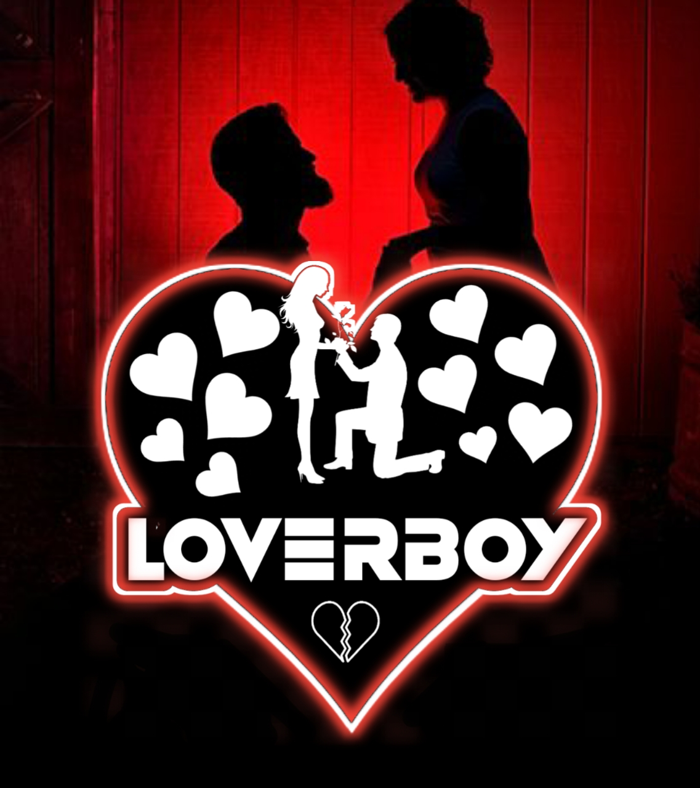

# H! There  !!

 

 

---

# I am Adarsh || 
<ul>
 <li>✨ I am currently focused on Learning </li>
 <li>📱Contact me via <a href="https://DevAdarsh.me/contact"> Social Media </a> </li>
 <li>🚓 👯 I’m looking to collaborate to work together </li>
 <li>🆘Ready to Help!! </li>
</ul>

# ⚙️My Tools🛠️
 
 

 

 

 
 

 

 

# Lαηgυαgєs 

 
 
 

 

# Contact Me:
 
 
 

 

 

 

# 🍬**Ɗყηᴀʍɨᴄ's ƓƖƬӇƲƁ ṩƬƛƬṩ**🍭

---

 

 

    

 
<!--  ///////////////////// Activity-->

 

 
  
 
 # WakeUp Time With Languages 🧑🏻‍💻
 
<!--START_SECTION:waka-->
<!--END_SECTION:waka-->

 <b>ᴍᴏṩᴛ ᴜṩᴇᴅ ʟᴀɴɢᴜᴀɢᴇṩ:</b>
 
  
 
 <b>•Lɪɴᴇ ᴏғ ᴄᴏᴅᴇ:</b> 

 

  <b>Note:</b> <i> Top languages is only a metric of the languages my public code consists of and doesn't reflect experience or skill level.</i>
 

## Trophys🏆

 

 

## ❤️Visitors || Follower🖤

 |    

# ~Thanks...To Visit❤️🥰

 
  

